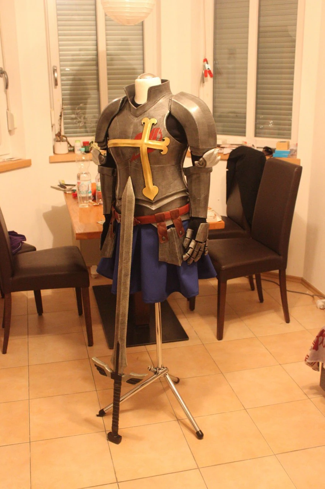
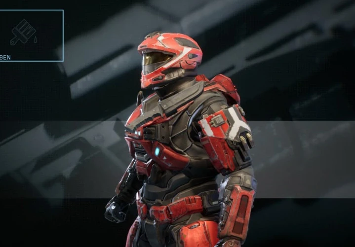
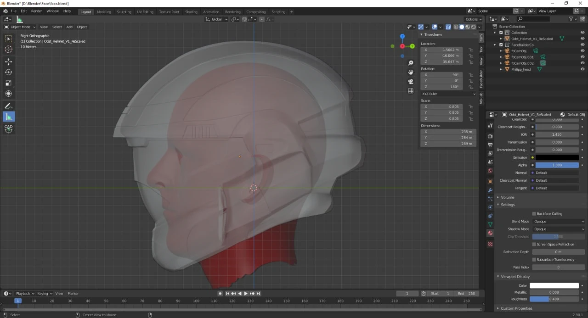
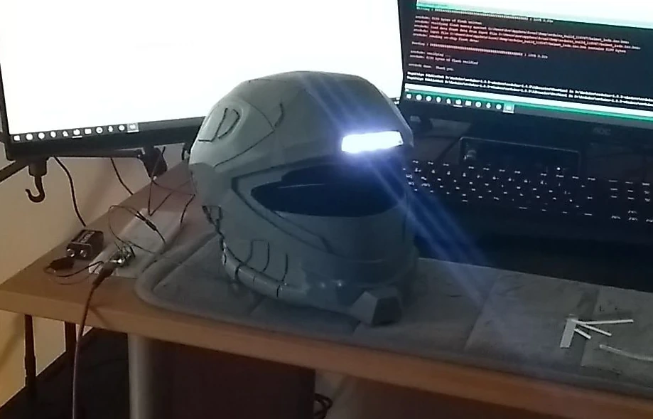

# That one time I modelled my own head ...

..was creepy.

## It all started

with me getting into cosplay. Cosplay was always the thing I did know existed, but wasn't really sure what to think of it. Until I got invited to a convention.

I've gone all out and built a whole plate armor for my girlfriend. She cosplayed Erza from fairy tail.

I made it all from EVA foam, Arylic paint and Latex. With the simplest tools: A cutter knife and a dremel.

I also made Erzas winged sword. Totally LARP conform. With a fiber glass rod in the middle, enough cusion and a soft tip.
That way we could take it inside and run around the convention without getting any problems at all.

I did go as Mystogan. My girlfriend made the clothing and I made all his staffs.

It was fun and I got tons of compliments for my builds, which pushed me good and was great for my ego. :D

We went to another convention not long after that and there I saw some guys with halo mjolnir suits.
And I thought to myself: why didn't I think of that?
It is my most favorite game of all time and reminds me of my childhood.

So the plan was settled.

## I always wanted a 3D printer

and now I had the excuse to buy one. I wanted to build my own mjolnir and I wanted to print it myself.

I decided to do the Recon Armor, since I didn't want to look the same as everyone else and I always liked the looks of it in Halo multiplayer.

The Ender 3 Pro was on sale for 160€, so I gave it a shot.
It arrived 2 days after and the assembly was easy and intuitive. I totally can recommend this printer, since it's awesome.

I made sure to assemble everything to the best. I mesured all the party, made all the angles perfect 90°, I modified the z-achsis holder and drilled a few new holes, so that I could adjust the x-achsis to my liking.

>I think I make a complete post about just that.

I had no experience, but the PLA printed fine. But I wanted my cosplay parts to be more durable, excpecially in a car during the summer. So I ordered some PETG.

It wasn't that easy at first, but I got it to work. The stringing was less of a problem, more was the adhesion of the print to the stock printbed.
>I will also inlclude this in the other post.

I figured that it's mainly the setup of the printer that decides over how the prints turn out and less the settings of the slicer.

## I got the helmet

model from thingiverse. It was a happy coincidence, that someone made the exact helmet I wanted to print as a 3D model.

But it wasnt perfect. It clearly wasn't meant as a helmet you could really wear on your head.
So I had to to some tweaks to make it work.

I removed the bottom and added some thickness to the model.

<!--  -->

I wanted it to fit perfect on my head and I didn't want to make any testprints or produce any waste at all.

So I had to come up with an idea. It was so simple as it was complicated :D

I would just model my own head in blender and then fit the helmet virtually.

I started by measuring my own head with some measuring tape and took a note of all the values.

I blender I used an add-on to get a generic head model.

From there on I tweaked it to my size.
For an even more accurate model I took some pictures of my head and imported them into blender, too.

This was all pretty new to me and I didn't really have any blender experience, so it took a while.

But I eventually got it right and started to fit the helmet.

## The next problem

occured, when I found out, that I cannot just pull of the helmet from my head. Because it was narrower at the bottom and PETG is not flexible at all.

I fixed this problem with a hinge mechanism on the back of the helmet. So the back can just flip open, my head can slip in and the helmet can close back up again.

My solution was to put on some magnets to secure the mechanism.

## I was happy

and imported the thing in Cura...

..where the next problem was just around the corner.

Of course the print didn't fit inside the 220x220x200mm print space of the Ender 3.

I had to slice it up.

## Back in Blender

I used some cubes and boolean modifiers to slice the helmet in I believe 13 different pieces. I looked for a way to slice it, so that I wouldn't have to use any supports for the print.

And I did a pretty good job in doing so.

## Now I was ready

to print.

I started with a 0.6mm nozzle, since this reduced the print time for one piece from 14 to 9 hours. And I printed the first piece.

After it was finished, I didn't like the finish of the part. The details where to washed out because of the 0.6mm nozzle, so I swapped it for a 0.4mm.

Since I printed all my parts over night, it wasn't that much of a big deal, that the prints took a little bit longer. The details were worth it.

I printed all the parts without a single one failing on me. Which suprised me a lot.

## After everything was printed

and ready for the assembly, I found another little problem. The prints didn't align 100%. That is, because my printer wasn't assembled with all 90° angles, but ever so slightly off.

>That was a big reveal for all my future print, because I recalibrated my hole printer and since then it prints perfectly.  
Prints often look better right of the bed of my Ender 3 than the ones from my friends CR10.  
And that's huge if you consider the prince difference. But you have to put a litte more time into perfecting the Ender 3.

The problem of the slight missalignment wasn't that big of a deal. After glueing everything together with CA glue, I could fill up the very small gaps with some car body filler and sand it down to a nice finish.

## The moment of truth

was when I tried to put on the helmet for the first time.

Long story short: It was a perfect fit at first try and it looks amazing.

## The last thing I did

was to add the LED lights to the helmet.
I used an Arduino Pro Micro, a 9V battery and some adressable LEDs.

With a switch in the back, you can choose from bright white light, dimmed yellow light, grenn blinking (mainly for cosplay conventions to get some attention) and a police car red blue blinking pattern.

The last one was a bit of work since I had to watch some police car footage to find out about the right pattern of the colors and the blinking. But it turned out really well.

>I think I could write a complete post about this topic alone. And maybe I will :)



---
   
## Future Work:

It was winter, so for the paint job I wanted to wait until the days get warmer and I can paint it outside.

In the meantime I started with the body armor of the suit and finished the first piece.

It all came to an apprupt stop, because of some problems in my life and I wasn't able to finish it yet.

But I'm looking forward to it.

:)