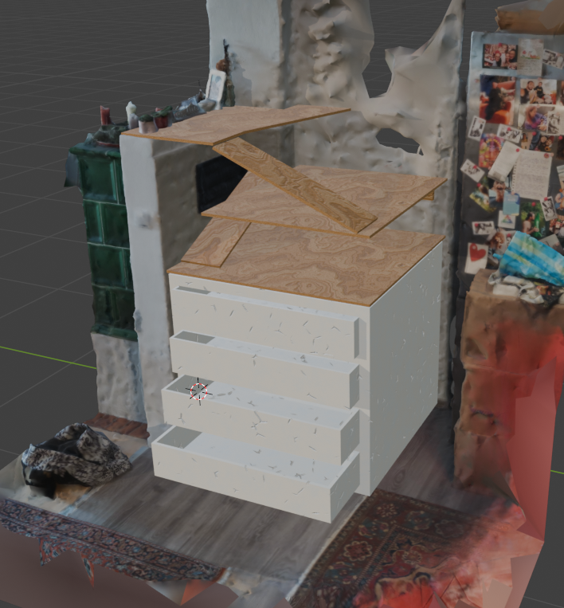

For the 3D scan, I used the app Reality Scan. It's free, but note that your files are public. This app uses photogrammetry, and you can download the scan as a GLB file. Blender works fine with that format and even includes UV mappings.

To import into Blender and bring it to scale:
1. Measure two points where you did real-world measurements.
2. Calculate the scale factor:

$$ \text{Scale Factor} = \frac{\text{Real Distance}}{\text{Blender Measured Distance}} $$

Here are some initial ideas:

I added a cabinet under the turtle house to get more storage room in the kitchen.

