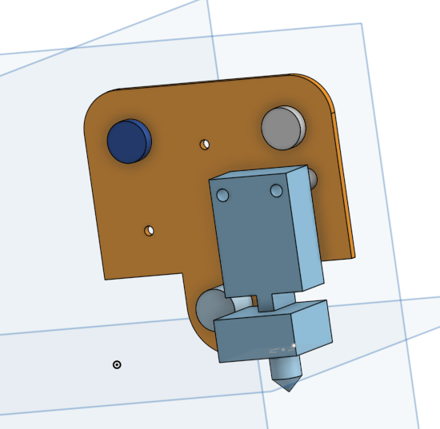
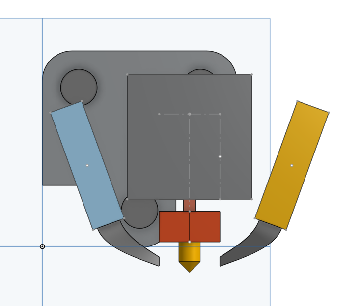
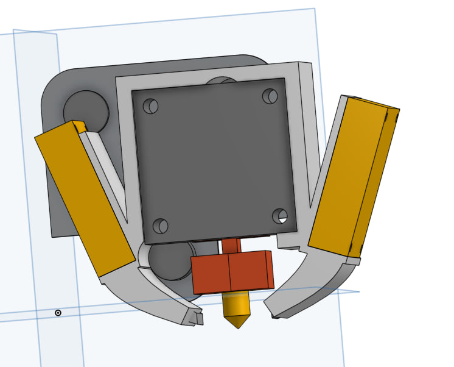
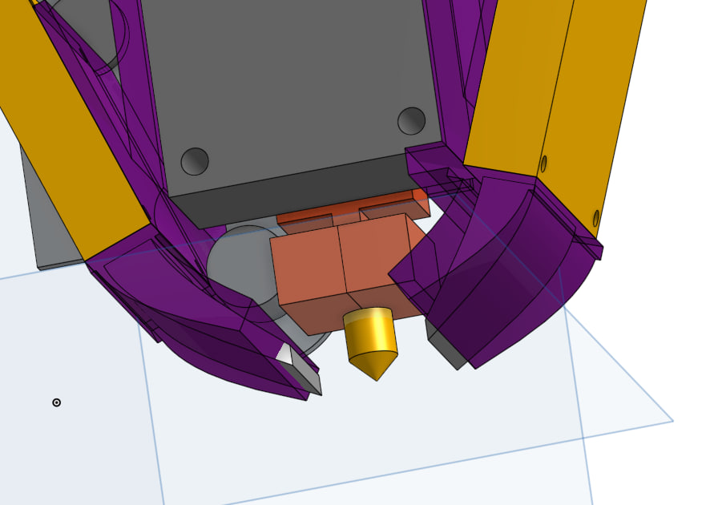

# Design of a custom Ender 3 hotend fan duct

... because not a single one I found on thingiverse was "good" enough.

They either did not fit properly, were potentially hazardous due to being too close to the hot end, were excessively large and interfered with the bed clamps, or simply did not meet aesthetic standards. Many designs lacked the precision and functionality required for optimal performance, leading to issues such as inadequate cooling or airflow obstruction. Additionally, some models were overly complex, making them difficult to print and assemble. This prompted me to design a custom fan duct that addresses these shortcomings, ensuring a perfect fit, safety, and improved cooling efficiency while maintaining a clean and streamlined appearance.

## Key Design Goals

1. **Safety**: Ensure the fan duct is positioned at a safe distance from the hot end to prevent any potential hazards.
2. **Printability**: Design the duct to be easily printable without the need for supports, reducing print time and material usage.
3. **Aesthetics**: Create a visually appealing design that complements the overall look of the Ender 3.
4. **Compatibility**: Provide space for two 4010 fans and one 4020 fan to enhance cooling efficiency. (Maybe 5015 design later on)
5. **Fit and Functionality**: Ensure a precise fit that does not interfere with bed clamps or other printer components, and optimize airflow for effective cooling.

## Detailed Design Considerations

- **Material Selection**: Use heat-resistant materials such as PETG or ABS to withstand the high temperatures near the hot end.
- **Mounting Mechanism**: Design a secure and stable mounting mechanism that allows for easy installation and removal.
- **Airflow Optimization**: Incorporate features that direct airflow efficiently towards the hot end and the print, ensuring consistent cooling.
- **Ease of Assembly**: Simplify the design to minimize the number of parts and assembly steps, making it user-friendly.
- **Durability**: Ensure the duct is robust enough to withstand regular use and potential impacts during printer operation.

By focusing on these key aspects, the custom fan duct will provide a significant improvement over existing designs, enhancing both the safety and performance of the Ender 3 printer.

## Creating a teamplate in onshape
To create a precise and fitting design, I took exact measurements of the Ender 3 hotend. Using these measurements, I designed the custom fan duct in Onshape.

