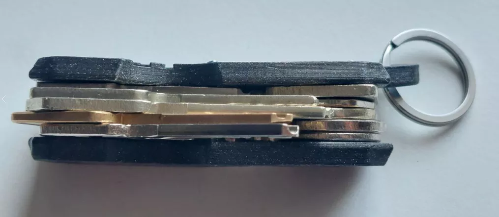
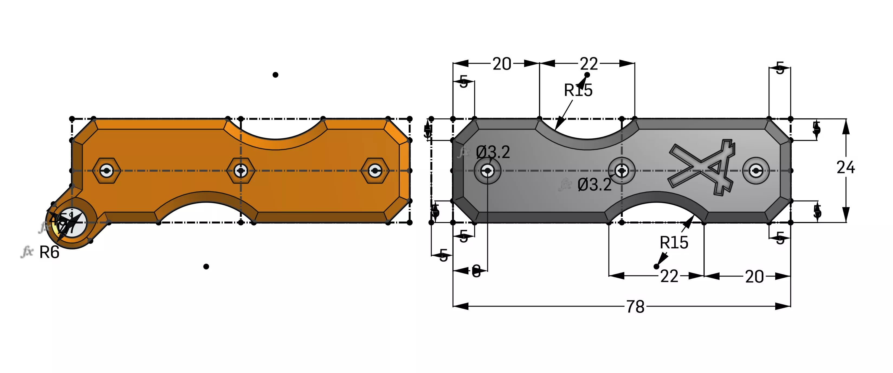
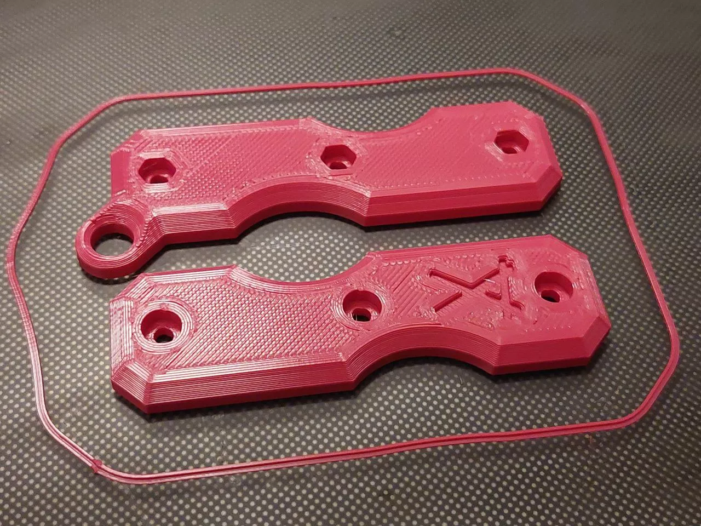
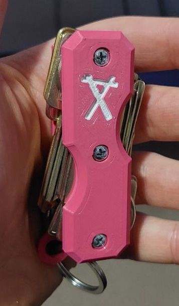

# For over a year,

I used a key holder I found on Thingiverse, created by **Protean Man** ([link here](https://www.thingiverse.com/thing:2749745)). While the design was functional and made my life a little easier, I had a few gripes with it right from the start.

## What Didn’t Work for Me

- **The Logo**: Protean Man’s logo is prominently displayed on the key holder, which always annoyed me.  
- **The Model**: The STL file had quite a few unnecessary vertices, and the overall form felt strange and not as streamlined as I’d like.  

Still, I printed it in PLA and used it for over a year. It held up surprisingly well, but by now the key holder is warped and it's time for a new one.

## Instead of just remixing

the original design, I wanted to create something from scratch—my own design, with my own logo, and improvements to the form and durability. I used [**onshape**](https://www.onshape.com/en/) to model it.

## For the new key holder,

I printed it on my **Ender 3 Neo Max**, using **PETG** from **Filament-Unger** ([link here](https://filament-unger.de/)). Here are the print settings I used:

- **Layer Height**: 0.2 mm  
- **Wall Thickness**: 4  
- **Nozzle Temp**: 220°C  
- **Bed Temp**: 80°C  
- **Speed**: 50 mm/s  
- **Infill**: Gyroid 20%  

The PETG material makes it far more durable than the original PLA version, and I’m confident this one will last much longer.

## The new key holder

is exactly what I wanted: robust, simple, and with a design that feels uniquely mine.  

I won't upload this one to thingiverse, because it's uniquely mine and there are a ton of there up there already :)