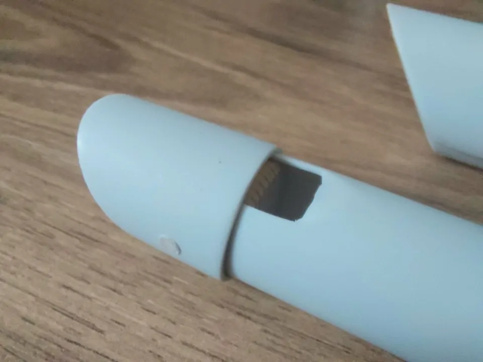

# Some time ago...
...I started to build my own tin whistles.

## PVC

It all started with simple flutes made from PVC pipes and wood.

I made a bunch of them. There were many more, but I gave them away to friends.

I made the head quite simple for the PVC flutes. A wooden plug is simply inserted and then sawed off at an angle. The wind hole is made with scissors and files and the blade beveled with a file. All this can be done with the simplest household tools. Scissors, knives, saws, nail files.

The flutes are even easier. You just have to drill a blow hole in the top and close the tube with a plug.

I used an online calculator (https://music.bracker.uk/Music/Whistle-Calculator.html) to calculate the hole position. Since the calculations for this are very complex, I have saved myself this effort for now. But sometime I still want to integrate it into the scad file.

The sound is amazingly good and reminiscent of woodwind instruments.

The tuning of the fluets is a bit tricky. You file the holes bigger and bigger, which makes the tone sharper. As you can imagine, it's a one-way process. If you make a mistake, there is no way back and you have to start over. In the process, the very first thing is to start to cut the pipe to the base tone. You make it a little sharper than necessary, because the base tone is flattened by the drilling of the holes and the resulting increase of volume.
You work your way up all 6 holes. One at a time.

## Aluminium

Over time I moved on to building them out of aluminum.

They sound very similar to PVC flutes, but if you change the mouthpiece a little they can also sound like trumpets. Kind of tinny.

## 3D Printed

And finally the last step was a very obvious one:

I started to design my mouthpieces myself in OpenSCAD and print them with the 3D printer.
As a reference I used my clarke sweetone which was my first whistle and which I like very much.

It has a slightly breathy sound. And as it turned out, the breathiness of a whistle comes from the placement of the windway to the blade. Place it ever so slightly from the bottom edge to the windway and it's a very sharp and clean, almost brass instrument sound. Place it further in the windway and it make more of a wooden sound. It makes little or no difference what material the whistle is made of.

The terminology of a fipple is very complex indeed. So a added a lot of parameters to my scad file to be able to tweak around the setup.

It took me about 8 iterations until I had the design right. Now it prints perfectly and works right of the printer without any sanding or filing.

As for now, the blade sits right in the middle of the windway outlet. In addition, the air duct also tapers from the top to the bottom. This leads to a better playing experience, since less air is needed to play the whistle.

The size of the opening plays a crucial role in how loud the whistle is. In parallel to my normal mouthpiece, I have also been working on one that is very quiet. It's still a work in progress, but the point of it is to have a quiet practice whistle that you can play late at night or in an apartment.

