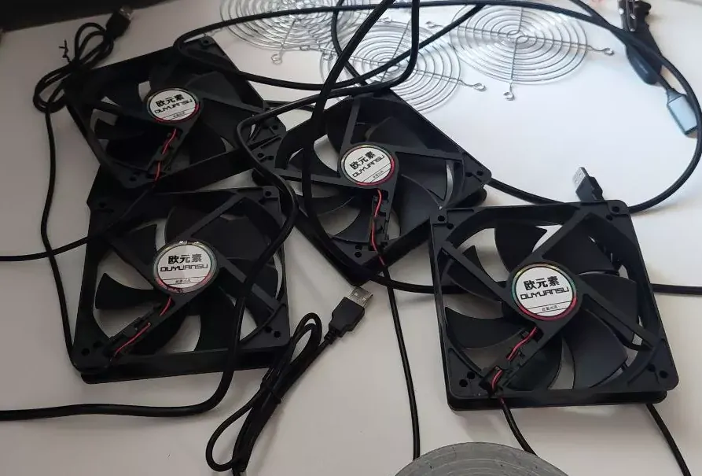
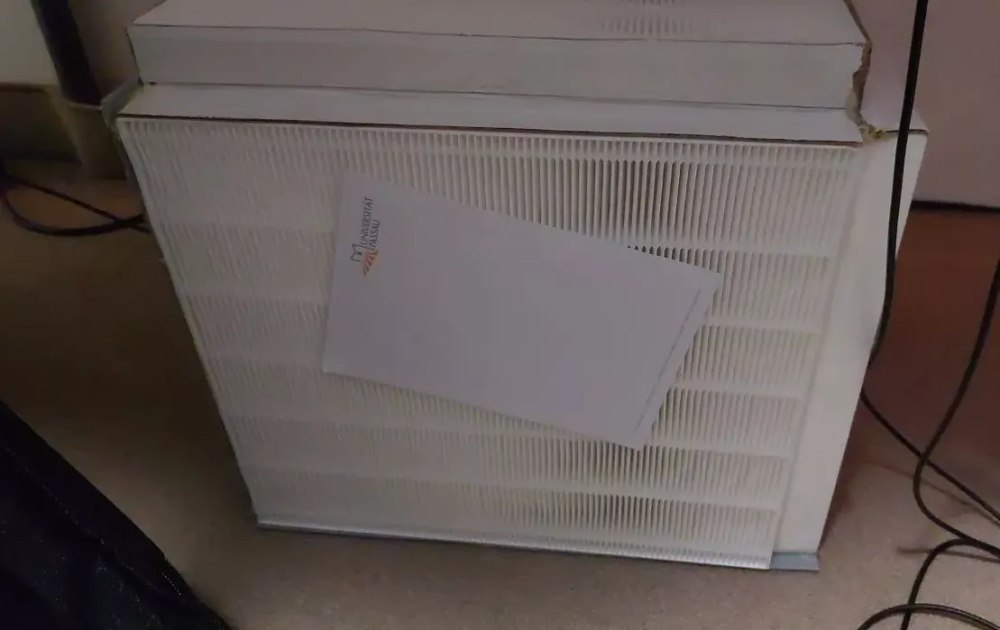

# This Monstrosity

is a simple air filter box.
It's not a beauty, but it does its job very well.
The 4 fans are powered by 5V and are very quiet.

My room in the dormitory has an old carpet. Although I have already cleaned it for several hours with a wet vacuum cleaner, it is still extremely dusty in my room every day.
In addition, I have many trees outside my window that I am allergic to. That's why I built this powerful HEPA filter.

# The Price

is not particularly high either.
I didn't see the point in spending so much money on a box like this. Other DIY solutions also end up around 300€.

I actually managed to build this thing for just **70€.**

# I ordered the parts

from China. 🤫

The Hepa filters are 38x33cm in size and cost me 10€ each.

I got 4 120mm 5V USB fans with protective grills for 5€ each.

In addition, a 4-port USB hub and a 3m cable for 5€.

The finishing touch is a rigid foam board from the hardware store, also for 5€.

# The Performance

is surprisingly good!

You can clearly feel the airflow on all sides of the box. It is even strong enough to easily suck in a piece of paper.

# I built it

as cheap and good as possible.
The angles holding the box together are the corners of the shipping carton in which the filters were delivered.

## The glue

is only hot glue, everything is held together with it.

I also sealed each edge with a line of hot glue at the end, creating a completely airtight box.

I read something online which finally let me decide on going full hot glue on this project. Lot's of DIYers build their stuff with duct tape. But one guy pointed out, that the tape never fully dries and releases fumes over a long period of time. And he is acutally right. I store all my stuff in sealable containers. Spray paint, grease, electronics and also my sticky tapes. And I can tell you, if you open one of those boxes, a big cloud of fumes comes directly to your face and almost let you faint. 😄

So hot glue it was, till it is easy to work with and it hardens in the end.

## The fans

I initially wanted to install in a way that they blow the air out of the box from the top, creating a vacuum inside the box. However, when testing the fans, I noticed that they vibrate strongly in a horizontal orientation and are no longer whisper-quiet.
On the other hand, when mounted vertically, they run completely quietly.
To avoid unnecessarily shortening their lifespan and dealing with the humming noise, I decided to completely change my plans and install the fans vertically on one side.
But that doesn't affect the performance of the device, and it works just as well.