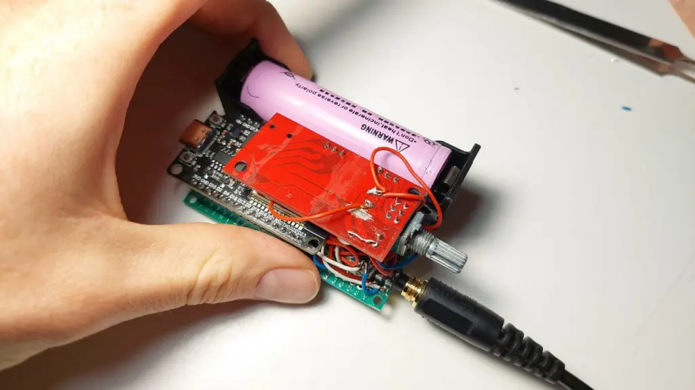

# ESP32 music player - part 2

I used the player for a few hours now, but I noticed a big flaw in my design. Well design is a little far-fetched. I just put a few parts together and called it a music player. :D

# The first iteration

In the first iteration I tried my headphones directly on the PCM5102 and they sounded amazing and loud enough for my taste.
But something felt off using headphones directly on a DAC preamp.

I did a little research and found out, that the PCM5102 is designed for low-current and high-impedance loads, like that of amplifiers.
Not the low impedance and current-hungry nature of headphones. Talking 16-80 ohms headphones.

I figured, that it also could damage the DAC or my headphones in the long run.

# The second iteration

I almost immediately went down to work and cracked the glued and beautifully painted housing open again. This hurt real bad...

I had a MAX4410 laying around from another project.

## New goals

The goals for the second iteration were:
- rework the complete layout of the components
- remove the micro-usb port for charging and use the usb-c of the esp to both charge and program the player
- integrate the MAX4410 without making the overall footprint bigger
- use the switched pot of the max as the power button

## Work...

So I removed everything. The switch, the buttons, all the wires, the modules. I started over again. Moved all the components to new places and I stuffed a lot more in there. A new step down module to power the esp, the dac, the sd card reader and the amp. Was a little worried that this would be a little much for the small esp ldo.
I also added a mode button, so 3 buttons in the new version. And I added a neopixel to show the modes with different colors.

The headphone jacks of the dac and amp got removed to reduce their size and I soldered one of them directly to the pcb.

The traces of the volume pot on the amp were cut, and I placed it between the charger module's 5V and the buck converter. So it can switch the whole player.

It was a success and I'm pleased that the whole thing really didn't become much bigger.

> a lot of new cables...

> the finished thing

# More flaws

I found out that the MAX4410 sounds like a good idea on paper, but it’s not really made for full-blown line-level signals like the PCM5102 puts out.

It ends up being way too loud, with barely any control over the volume. I had to set the gain to 0.05 on the software side, which is a very bad idea, because this throws most of the PCM5102's dynamic range out of the window...

## A fix for now

As the assembly and the components do not survive yet another disassembly, I will drop a simple resistor voltage divider between the DAC and the amp to reduce the input signal. That brings the volume down to something usable without losing the dynamics of the PCM5102.

## For the next step

A better fit is something like the TPA6132. It handles proper DAC output levels, drives headphones cleanly, and just plays nicer overall. This chip comes on a small module, simple and plain. Without audio jack and volume pot.

So I ordered a bunch of new stuff for the third iteration.

# What comes next?

The next iteration will be smaller and again a little better. I still want to use a 18650 battery with around 3500mAh, because they are safe and I like their heft and overall look. Also their easy way of being replaced.

I will not use a full ESP32 dev board, but a esp32 cam module. These modules come with a sd card reader on board and yet are smaller than the full dev boards. They have a separate programmer board, which is really nice.

I'm still going to use a PCM5102 as dac, I like them for their low noise level and high dynamic range.

A TPA6132 is going to be used as the headphone amp, with a stereo volume pot in between the dac and the amp.

I also found nice charging boards for the 18650 batteries with usb-c ports and I will combine them with fixed 5V to 3.3V step down converters. I played with the idea of skipping the boost and buck steps and using a buck directly on the 3.7V battery, but most of them - especially the small ones - need at least a 1V difference to work. So from 3.7V to 3.3V is not going to work for now. I'm sure there is a way, but I need a little more research for that.