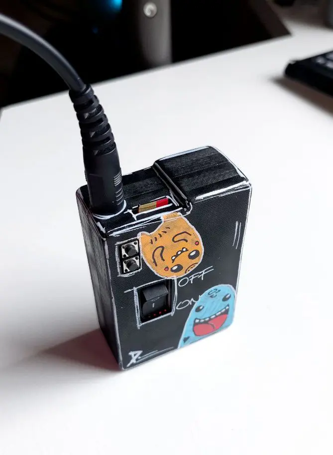
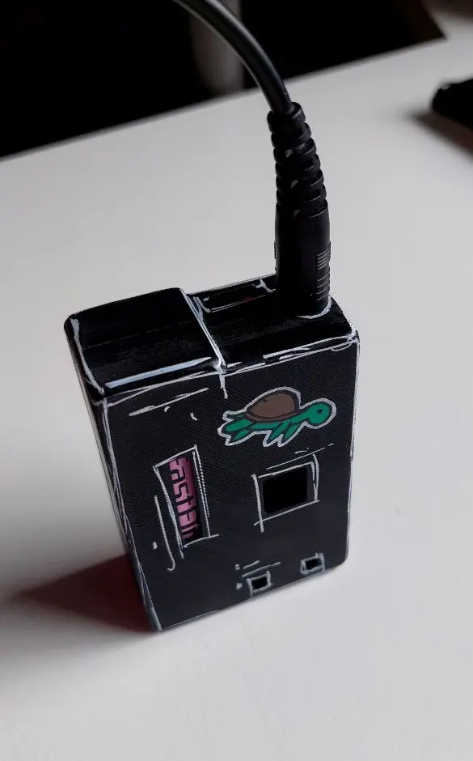
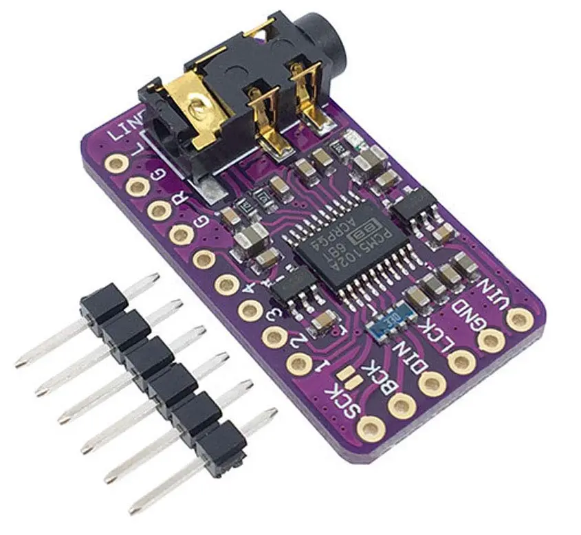
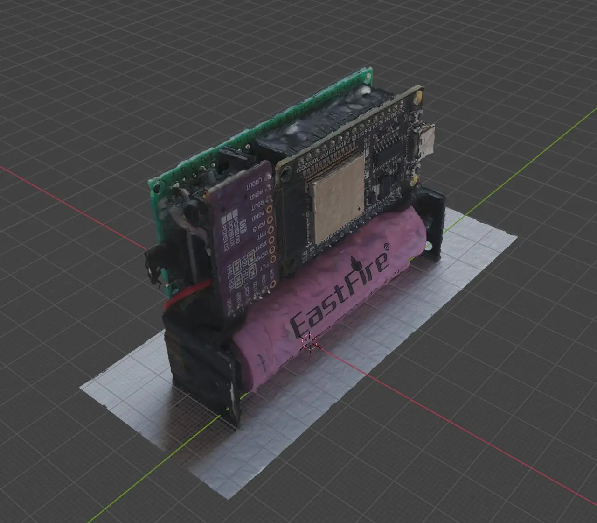
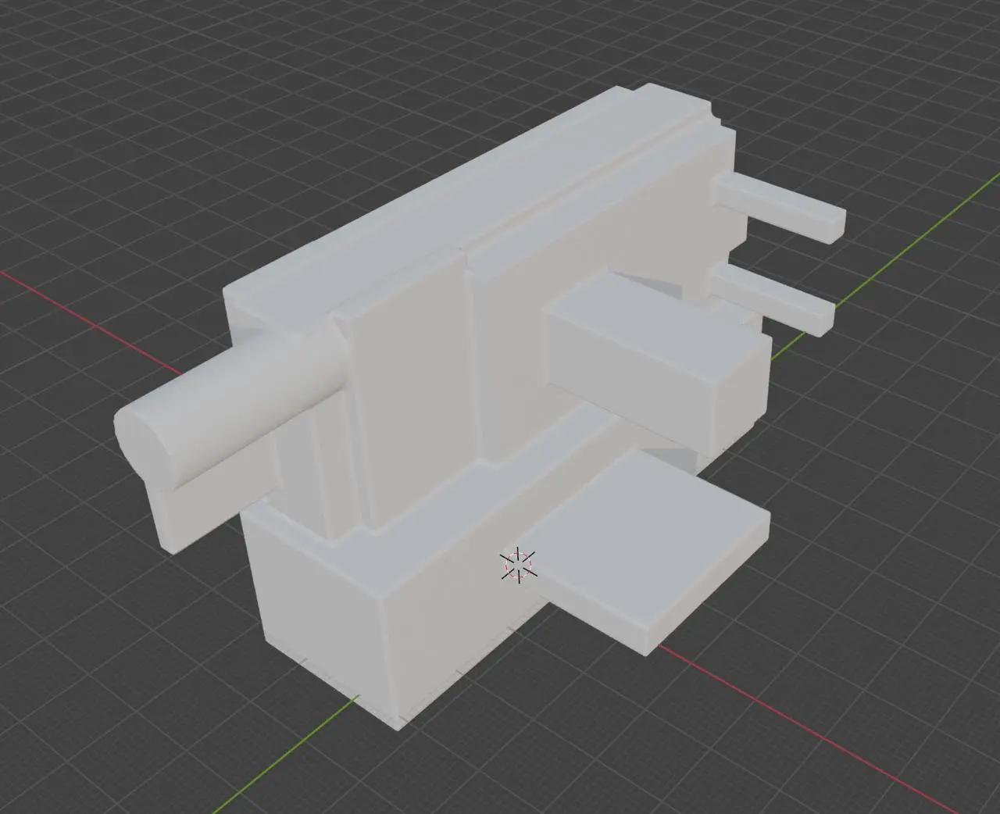
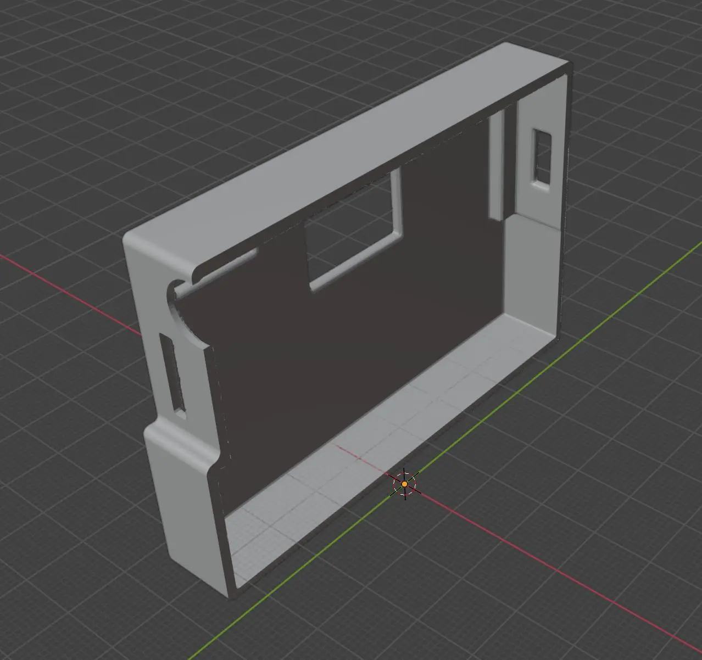

# ESPod - Shuffle
instant music - free of distractions

no boot time, no menus, no bullshit!

❤️❤️❤️❤️❤️❤️❤️❤️❤️❤️❤️❤️❤️❤️❤️❤️❤️


> the front side with cute ghosts


> and the back side with a little, cute turtle

---

# Yes it's true
I built an ESP32 based music player that can play mp3, wav and flac!

Well, flac is more a proof of concept, including stutters and lags. But the rest works exceptionally well!

I was totally surprised by the music quality this 'little' thing can deliver.

## What was my goal?

I wanted a super simple, high quality, beefy music player that could take a punch and had a good feel to it.

It also should act like an oldschool cassette walkman! Press play and the music starts where you left of last time - stop and throw it in the bag.


So buttons with a good haptic feel were crucial.

I think I achieved my goal. A big and snappy button starts the player and music is playing in an instant. A bookmark is saved every second, so when you turn the player off and then on again, it continues exactly where you stopped listening.

# The parts

For this project I used:

- ESP32 WROOM Dev Board
- PCM5102 Modul DAC I2S
- Generic SD card module
- 134N3P 5V step-up power module
- 18650 battery
- 2 buttons
- 1 beefy on/off switch


> the heart: the PCM5102

## Why?

I recently did a project at work with ESP32s and I kind of fell in love with them, so I ordered a bunch without knowing what to do with them - then came this project. :)

The PCM5102 I did order for another project. I built a few Icecast receivers for a silent disco, but then switcht to snapcast. As this was too much to handle for an ESP, I used Raspberries with USB audio-interfaces for this project and was left with this nice DACs. The audio quality is amazing! I really did not expect that depth and clearity from that little module.

The SD module is self explanatory. It's used to read the music from an SD card.

The 18650s I savaged from old notebook batteries. I really love upcycling stuff. <3

For powering the whole thing and for charging the battery, I use the very simple 134N3P. It's designed with 18650 batteries in mind and gets the job done quite well.

# The code

Oh boy the code... it was a nightmare.

As always, you can find the complete code of this project on my github: [esp32mp3](https://github.com/GrafKnusprig/esp32mp3)

Feel free to do what ever you want with this :D

I used the ESP8266Audio library and got the first results pretty fast. After only 5 minutes with ChatGPT (more about this later) I had the first audio files playing on my headphones and I was stunned! The resolution of the sound was extraordinary! I later found out, that the PCM5102 is one of the higher end modules for audio and loved by the community.

That was where the journey began...

## A week of agony

So listen up. This section is important and can prevent you from running into the same problems!

After the first baby steps I continued to build a full on audio workhorse with the help of ChatGPT - better use that pro subscription!
I very soon ran into strange and non-deterministic problems. Sometimes everything worked and some other times the esp crashed with an Guru Meditation error or access violation completely out of nowhere.

The code that ChatGPT provided was simple and I thought that there's nothing wrong with it.

``` cpp
// if a track is running -> close it
if (mp3.isRunning())
    mp3.stop();
if (wav.isRunning())
    wav.stop();
if (flac.isRunning())
    flac.stop();
fileSrc.close();

//...

// then start the new track
if (path.endsWith(".mp3") || path.endsWith(".MP3"))
{
    currentType = TYPE_MP3;
    if (off)
        fileSrc.seek(off, SEEK_SET);
    mp3.begin(&fileSrc, &audioOut);
    isPlaying = mp3.isRunning();
}

//... same for the other file types
```

## The functions

A quick overview over the functionality of the player. We need that to go on.

- volume up -   press the up botton once
- volume down - press the down button once
- next track -  hold the up button
- previous track -  hold the down button

- in the first attempt there were 2 modes:
    - shuffle all
        - shuffles all songs on the sd card
    - shuffle folder
        - shuffles only the songs of the current folder
    - the 2 modes can be switched by pressing and holding both buttons
    - you can skip to the next folder by shortly pressing both buttons

## Back to the agony


... Sometimes the ESP didn't crash for 10 songs, then it crashed every time you skipped to the next song.

Hours and hours I spent together with ChatGPT trying to solve the problem. I added locks, memory-saving methods, checked the heap, and used mutexes to regulate read and write access to the SD card. All without success.

Then it dawned on me. It wasn't that I had forgotten how to code—the problem was ChatGPT itself. It kept going in circles, making the code more and more complex and convoluted, and nothing made sense anymore. The errors piled up and nothing worked as it should. At that point, I was ready to give up on the project entirely. But then I decided to start over from scratch and tackle the problem myself.

The only thing I kept from ChatGPT's logic was accessing the SD card using a mutex. That actually made sense. Everything else I solved the conventional way: I read documentation and looked at examples. It turned out that you have to handle the library a bit differently:

```cpp
// Stop any running decoder and cleanup
    if (mp3 && mp3->isRunning())
    {
        mp3->stop();
        delete mp3;
        mp3 = nullptr;
    }
    if (wav && wav->isRunning())
    {
        wav->stop();
        delete wav;
        wav = nullptr;
    }
    if (flac && flac->isRunning())
    {
        flac->stop();
        delete flac;
        flac = nullptr;
    }

    if (fileSrc)
    {
        fileSrc->close();
        delete fileSrc;
        fileSrc = nullptr;
    }

    //...
    if (currentPath.endsWith(".mp3") || currentPath.endsWith(".MP3"))
    {
        currentIdx = idx;
        currentType = TYPE_MP3;
        if (off == 0)
        {
            uint32_t skipped = skipID3v2Tag(fileSrc);
            LOG("Skipped %u bytes of ID3v2 tag\n", skipped);
        }
        else
        {
            fileSrc->seek(off, SEEK_SET);
        }
        mp3 = new AudioGeneratorMP3();
        mp3->begin(fileSrc, audioOut);
    }
```

Can you spot the difference?

## Technical Comparison: Object vs. Pointer-Based Implementation

In the initial code, decoder objects like `mp3`, `wav`, and `flac` are used as stack-allocated objects (not pointers). Methods such as `mp3.isRunning()` and `mp3.stop()` are called directly on these objects, and there is no explicit memory management—objects are created and destroyed automatically as their scope changes.

In contrast, the improved code uses pointers for all decoder objects and the file source. For example, `mp3`, `wav`, `flac`, and `fileSrc` are all pointers. This approach allows for dynamic allocation (`new`) and explicit deallocation (`delete`) of resources. Before starting a new track, the code checks if a decoder exists and is running, stops it, deletes the object, and sets the pointer to `nullptr`. This ensures that resources are properly cleaned up and avoids memory leaks or dangling references.

## Another problem

was that some mp3s took an eternity to start playing. After a little testing and researching I found out, that this was probably due to the mp3 tags in the files.

I stumbled upon this nice little method to skip those tags in a very elegant and fast way:

```cpp
uint32_t skipID3v2Tag(AudioFileSource *src)
{
    char header[10];
    if (src->read((uint8_t *)header, 10) != 10)
        return 0;

    if (memcmp(header, "ID3", 3) != 0)
    {
        src->seek(0, SEEK_SET); // not an ID3v2 tag
        return 0;
    }

    uint32_t tagSize =
        ((header[6] & 0x7F) << 21) |
        ((header[7] & 0x7F) << 14) |
        ((header[8] & 0x7F) << 7) |
        (header[9] & 0x7F);

    uint32_t skipBytes = tagSize + 10; // +10 header
    src->seek(skipBytes, SEEK_SET);
    return skipBytes;
}
```


This works like a charm!
The tags are now skipped in a few ms instead of 30 seconds.


This was the final change that made the player what I intended it to be.


A digital music player that behaves like an old-school cassette player! Turn the switch on and music starts playing instantly! No boot time, no screen, no menus. Just music without distraction.

# Finish line


This change made all the difference. Finally, everything ran smoothly. There are still occasional crashes that I haven't fully tracked down yet, but they're mostly a thing of the past. Most of the time, the player now runs stably.

# A nice case


Of course, the player also needed a nice home. This time, I tried a new approach. I scanned the whole thing in 3D using the [RealityScan](https://play.google.com/store/apps/details?id=com.epicgames.realityscan&hl=en) app and then imported the model into [Blender](https://www.blender.org/).


I then quickly and roughly recreated the scan with simple objects like cubes and cylinders. I made sure to model all the openings to the outside in an 'exaggerated' way so that I would end up with an actual opening.

After that, I surrounded the whole thing with a large cuboid and subtracted the inside from the outside.


The result was a quick and very precisely fitting case that fit perfectly after printing the first time :) Just the way I like it.


(think twice, print once!)



> the 3D scan of the combined modules


> the remodeled scan


> the finished housing


# The End

Sorry that I totally skipped the whole assembly and soldering part, the layout and PCB arrangement...

I didn't make any images during the whole process, but I think yours will look completely different anyway :)

Have fun!