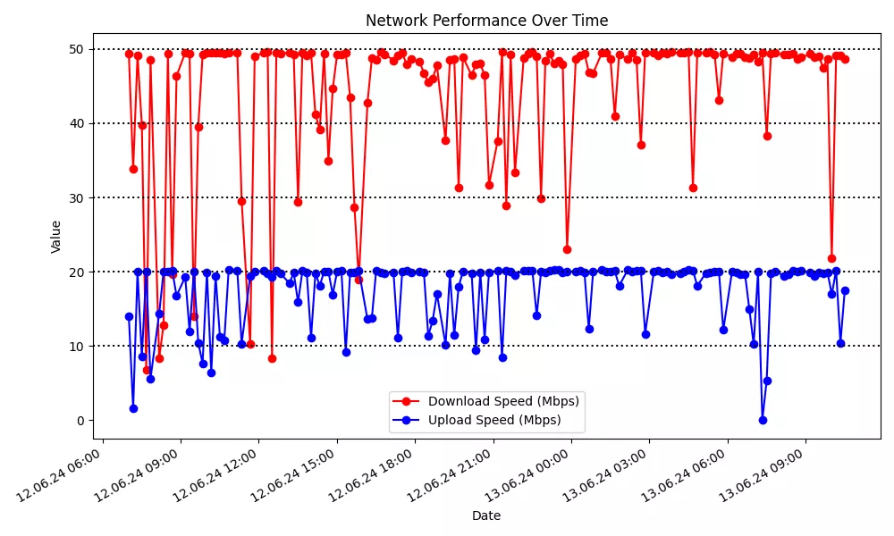

# In order to

monitor the stability of the internet connection in our dormitory, I decided to create a Raspberry Pi-based speed tester. The internet service provider recommends using the Ookla speed test for this purpose.

Since I had a few spare Raspberry Pis lying around, I utilized one of them for this project.

The Python program for the speed test can be found in my GitHub repository [SpeedPlotBot](https://github.com/GrafKnusprig/SpeedPlotBot)

The repository also includes a script for plotting the data and the necessary service and timer files for the systemd timer on the Raspberry Pi.

# For me, it was easiest
to set up a systemd timer on the Raspberry Pi.
Since cronjobs didn't seem to work for some reason and I gave up after a few hours of trying.
Simply copy the two files, speedtest.service and speedtest.timer, to the correct location following the instructions in the git repository and start the timer. Then your job will run automatically at the predefined intervals every time you turn on the Raspberry Pi.

So, whenever I notice connection issues, all I have to do is plug in the Raspberry Pi and the rest will be taken care of automatically.

# The data is stored
in predefined time intervals in a well-processable speedtest_log.csv file and also in a speedtest_log.txt file, which is formatted slightly differently.

*speedtest_log.csv*
```c
2024-06-11 18:20:42;Austria (speedtest.fonira.at:8080);10.082;13.965;25.266
2024-06-11 18:25:42;Austria (speedtest.alwyzon.net:8080);49.548;8.091;24.699
2024-06-11 18:30:42;Austria (speedtest02.timewarp.at:8080);47.641;19.914;25.538
2024-06-11 18:35:42;Austria (speedtest.alwyzon.net:8080);49.509;10.941;27.09
2024-06-11 18:40:42;Austria (speedtest.ba-lu.eu:8080);49.185;19.723;24.86
2024-06-11 18:45:42;Austria (speedtest02.timewarp.at:8080);49.291;19.894;26.261
2024-06-11 18:50:42;Austria (speedtest.fonira.at:8080);49.186;19.186;24.363
```

*speedtest_log.txt*
```
2024-06-10 08:30:05
2024-06-10 08:17:13
Server Austria (speedtest.nessus.at:8080)
Download Speed: 10.566 Mbit
Upload Speed: 8.514 Mbit
Ping: 45.735 ms
--------------------------------------------------
2024-06-10 13:11:44
Server Austria (speedtest.nessus.at:8080)
Download Speed: 34.396 Mbit
Upload Speed: 13.418 Mbit
Ping: 65.443 ms
--------------------------------------------------
2024-06-10 13:15:02
Server Austria (speedtest-vix.cosys.cc:8080)
Download Speed: 8.841 Mbit
Upload Speed: 2.9 Mbit
Ping: 90.904 ms
--------------------------------------------------
2024-06-10 13:30:02
2024-06-10 13:45:02
Server Austria (speedtest0401.anexia-it.com:8080)
Download Speed: 7.743 Mbit
Upload Speed: 2.295 Mbit
Ping: 86.105 ms
--------------------------------------------------
```

# I now regularly check

the internet speed and send the data to my provider.

With the script standalone-chart-plotter.py, you can easily generate a plot from the collected data.



# To retrieve the data on your PC,
you can simply use SSH to connect to your Raspberry Pi or use tools like [WinSCP](https://winscp.net/eng/index.php) or [PuTTY](https://www.putty.org/).

## Update
I have added a run-scripts.py that automatically fetches the latest data from the Raspberry Pi over the network and then creates a plot of the last n measurements.

Furthermore, I have implemented a switch --modern for the plotter, which plots the chart in a slightly more modern style.


# For the future
I have another Telegram bot planned. Because somehow I write a Telegram bot for every tool. Yeah, recently it was even easier to quickly write a bot for my deep net training to get status updates than to get it on my phone in any other way.
But currently, it's not a priority for me, so it may take a while.

That's how easy it is. Have fun! :)